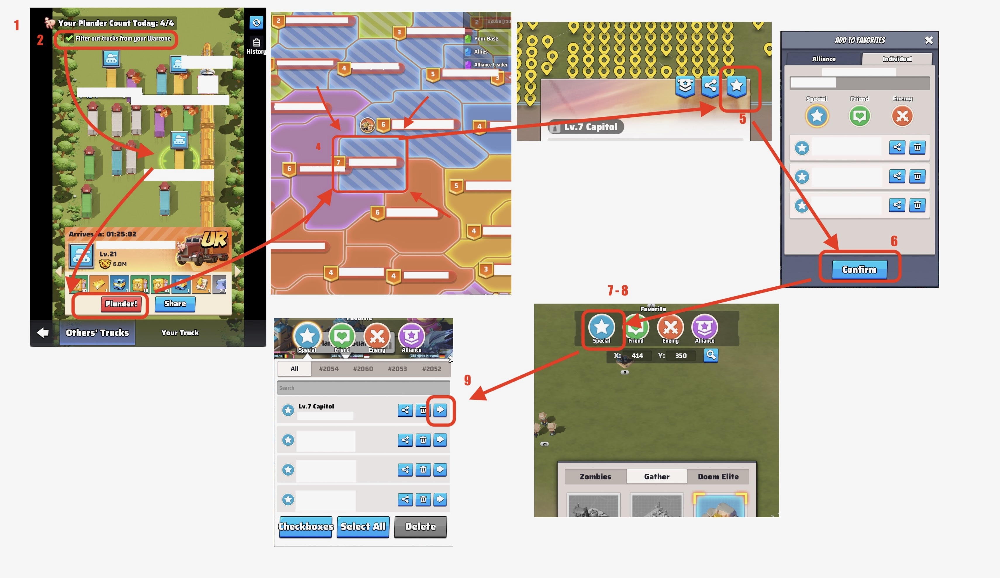

# Moving Between Servers

1. Open Truck Search at your base.
2. Enable "Filter out trucks from your warzone"
3. Select a truck/train and press "Plunder!"
4. After landing, zoom out, go to the capital, and press the star icon (top right).
5. Save it (e.g., "Special".)

To return:

1. Click the magnifying glass (bottom left).
2. Open your saved category.
3. Press the right arrow.

You'll land in the capital and can plunder trucks, trains, or secret tasks.

Check image for visual reference

